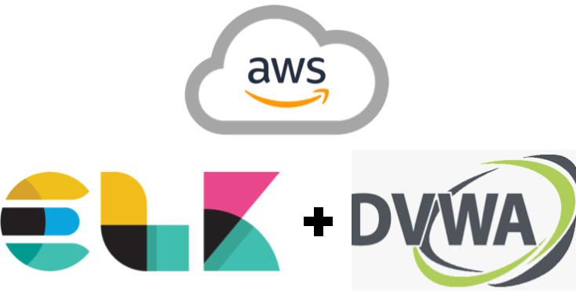
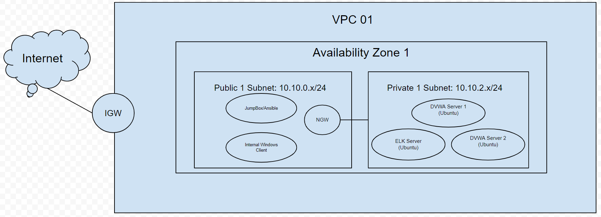

# CloudFormation: ELK + DVWA
<!-- markdownlint-configure-file { "MD004": { "style": "consistent" } } -->
<!-- markdownlint-disable MD033 -->

    
     

<!-- markdownlint-enable MD033 -->

# Purpose of the CloudFormation
The CloudFormation built here demonstrates creating a basic network on AWS that utilizes DVWA and ELK servers for testing and practicing purposes. 

    
     

Shown here is a diagram depicting how the network is configured where we have our instances that we can connect to over the Internet in the "Public1" subnet, and our instances that we don't want accessed in our "Private1" subnet (Our ELK server and DVWA server). 

Our subnets are also shown to be encapsulated in the diagram by the Availbility Zone used to host our virtual network. All connections are faciliated via the Internet Gateway, which is connected to VPC1

# Creating our Cloud Stack
Login into your AWS console and search for "CloudFormation"
Select "create stack" and do the following:
1. Select "Upload a template" Upload "Basic_Network_Cloud_Formation.yaml" (not .yml)
2. Select next and name your stack
3. Select next until you can launch your instance

Before setting up our instances, we want to modify our VPC configurations
1. Search for VPC in the search bar and select VPC, then look for subnets and select subnets "Public1" and "Public2"
2. Select the dropdown called "Actions" and select "Modify auto-assign IP settings". Once enside select the checkbox to enable auto-assign public IPv4 address.

# Setting up our Amazon Instances
Search for EC2 and select "Instances", and then create the following instances by selecting "Launch Instances":
1. Amazon Linux 2 AMI (HVM), SSD Volume Type
- Only need 1 Amazon Linux.
- Click next and select t2.micro
- Click Next and modify network and subnet:
  - Network: VPC1
  - Subnet: Public1
- Select next until you have reached "Configure Security Group"
  - Modify "Security Group Name" and "Description" and give it something meaningful (e.g. a meaningful name and description)
  - Should only have SSH as a rule
- Select Review and Launch

2. Ubuntu Server 20.04 LTS (HVM), SSD Volume Type
- Need 3 Amazon Linux.
- For first 2 (Our DVWA servers):
  - Click next and select t2.micro
  - Click Next and modify network and subnet:
    - Set number of instances to 2
    - Network: VPC1
    - Subnet: Private1
  - Select next until you have reached "Configure Security Group"
    - Modify "Security Group Name" and "Description" and give it something meaningful (e.g. a meaningful name and description)
    - Add the following rules: "HTTP"
      - HTTP Port should default to 80. Change "Source" to be "Anywhere" instead of "Custom"
        - Note: This is bad practice to set source to anywhere. Only done here for testing purposes  
  - Select Review and Launch
- For last 1 (Our ELK server):
  - Click next and select t3.medium
  - Click Next and modify network and subnet:
    - Network: VPC1
    - Subnet: Private1
  - Select next until you have reached "Configure Security Group"
    - Modify "Security Group Name" and "Description" and give it something meaningful (e.g. a meaningful name and description)
      - Note: We will be reusing this
    - Add the following rules: "HTTP", "TCP Custom" (need 5 TCP customs)
      - HTTP Port should default to 80. Change "Source" to be "Anywhere" instead of "Custom"
      - Custom TCP Ports should be 5044, 9600, 5601, 9300, and 9200. Change "Source" to be "Anywhere" instead of "Custom"
  - Select Review and Launch

3. Microsoft Windows Server 2019 Base
- Only need 1 Windows instance.
- Click next and select t2.micro
- Click Next and modify network and subnet:
  - Network: VPC1
  - Subnet: Public1
- Select next until you have reached "Configure Security Group"
  - Modify "Security Group Name" and "Description" and give it something meaningful (e.g. a meaningful name and description)
  - Should only have RDP as a rule
- Select Review and Launch

# Creating the Load Balancer
On the EC2 page, look for load balancers and once found, select create load balancer.
1. Select "Create" for the "Application Load Balancer"
2. Give our load balancer a meaningful name and set to interal, 
3. Select VPC1 so that we have access to our availability zones (should be 2 that appears) and select them.
- Make sure that the availability zones are set to Private1 and Private2 (the location of our DVWA servers)
4. Select next until we reach configure security groups
- Here we want to create a new security group for our load balancer where we use HTTP and SSH (similar to secuirty configurations for our DVWA instances)
5. Select next and now we need to create a new target group if none have been made yet
- Target group should be new target group
- Set name to be something meaningful
6. Select next and now look for our DVWA servers under "Name".
- Select tthe checkboxes to the left for our DVWAs and select "add to registered"
- Note: If you already have a target group set for our DVWAs, skip step 6.
7. Select next until you see "Create" and then select create.

# Setting up our Instances for Deployment
We want to connect to our instances now. Go back to the instances page and select Connect for our Jumpbox.

# Running our Servers

# Testing our Servers

