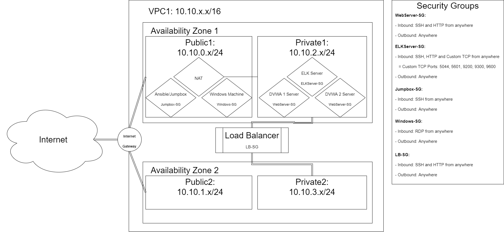

# CloudFormation: ELK + DVWA
<!-- markdownlint-configure-file { "MD004": { "style": "consistent" } } -->
<!-- markdownlint-disable MD033 -->
<p align="center">
    
    <br>
</p>
<!-- markdownlint-enable MD033 -->

-----

# Purpose of the CloudFormation
The CloudFormation built here demonstrates creating a basic network and automatic deployment on AWS that utilizes an ELK server and load-balanced DVWAs for testing, practicing, and learning purposes. 
<p align="center">
    
    <br>
</p>

### Understanding the Topology

Shown above is a diagram depicting how the network is configured where we have our instances that we can connect to over the Internet in the "Public1" subnet, and our instances that we don't want accessed in our "Private1" subnet (Our ELK server and DVWA server). 

Our subnets are also shown to be encapsulated in the diagram by the Availbility Zone used to host our virtual network. All connections are faciliated via the Internet Gateway, which is found on VPC1 and is connected to our "Public" subnets.

### Access Policies


| Operating System 	|       Name      	|    Subnet    	| Private/Public 	| Security Group 	|   Function  	|
|:----------------:	|:---------------:	|:------------:	|:--------------:	|:--------------:	|:-----------:	|
|      Ubuntu      	|    ELK Server   	| 10.10.2.x/24 	|     Private    	|  ELKServer-SG  	|    Server   	|
|      Ubuntu      	|  DVWA 1 Server  	| 10.10.2.x/24 	|     Private    	|  WebServer-SG  	|    Server   	|
|      Ubuntu      	|  DVWA 2 Server  	| 10.10.2.x/24 	|     Private    	|  WebServer-SG  	|    Server   	|
|      Windows     	| Windows Machine 	| 10.10.0.x/24 	|     Public     	|   Windows-SG   	| Application 	|
|   Amazon Linux   	| Ansible/Jumpbox 	| 10.10.0.x/24 	|     Public     	|   Jumpbox-SG   	|   Gateway   	|


-----

# What's The Point?
As industries move forward and into the cloud, the demand for cloud practicioners and their understanding of it has increased dramatically. Being able to deploy an enterprises network and its systems quickly is crucial as time is money for any business. Additionally, having to deploy just a few machines manually can be tedious, mind numbing, and time consuming for the indivdual tasked with setting things up. Essentially, **the faster you can do it, the better it is for both beneficiaries**. 

-----

# Understanding the Repository
This repository is for helping and practicing setting up a basic cloud network on AWS to host ELK and DVWA servers. Other things to setup will be MetricBeat and FileBeat to be used on our ELK server. The primary files to be used are daemon.json and the files located in the **"./Configs+Playbooks"** folder. You can follow the diagram above to get a visual understanding of how the network will look like in the end. 

The files in the Configs+Playbooks folder are: 
- Basic_Network_Cloud_Formation.yaml
- anisble-playbook.yml
- install-elk.yml
- filebeat-playbook.yml
- filebeat.yml
- metricbeat-playbook.yml
- metricbeat.yml

**"Basic_Network_Cloud_Formation.yaml"** is used to automatically deploy our network into AWS. It's recommended to play around with network setup yourself, but it's not explained here. If you're familiar with reading .yaml files, then it's strongly recommended to read through it and understand how each device interconnects with one another. If not, then you can refer to the network diagram on how it actually looks while ignorning the machine instances.

**NOTE:** If you're not familiar with AWS, then it's strongly recommended to setup an account on there now and explore the site yourself for now. Jumping into this without prior knowledge may lead to more confusion rather than helping oneself. This is especially the case when rebooting our network. More on that at the bottom of this README.

**"ansible_config.yml"** is what we use in our Ansible process to automatically setup our targeted Ubuntu machines to become DVWA servers. Everything in ansible-playbook.yml should be fine to leave as it is (in other word's no modifications should be needed. Change otherwise if it does not suit your needs). 

**NOTE:** If you're not familiar with DVWA, then look here for a simplified explanation. Otherwise skip to the next part (**"install-elk.yml"**). DVWA is the "Damn Vulnerable Web Application", a web penetration practice site for penetration testers (similar to bWAPP and HackThisSite.org). By it's name, it should be obvious that it is very vulnerable, thus its a great way to learn and practice with to gain a better understanding of web vulnerabilities. It's useful to have this setup on our network so that we can monitor and analyze what's going on. Here we are learning how to set it up on our own machines (the Ubuntu cloud instance, not your personal machine).

**"install-elk.yml"** does the same as ansible-playbook.yml, but it's purpose is to turn one of our targeted Ubuntu machines into an ELK server. Everything in install-elk.yml should be fine to leave as is.

**NOTE:** If you're not familiar with ELK, then look here for a simplified explanation. Otherwise skip to the next part (**"filebeat-playbook.yml"**). ELK (also known as the ELK Stack) is an acroynm that represents 3 widely used open-source technologies: "**E**lasticsearch", "**L**ogstash", and "**K**ibana" **(ELK)**. All 3 work in conjunction with one another to make analyzing and logging network activity more efficient in terms of understanding what is happening in our networks. 

In this industry where understanding and monitoring network activity is essential, we need to always record our network activity which can scale to unmanageable sizes. This is where Elasticsearch comes in. It improves searching among vastly large sets of logs by indexing each one of them. Logstash works in conjunction with Elasticsearch where it processes the log data and pipes it from multiple sources into Elasticsearch. The final component, Kibana, utilizes Elasticsearch to make everything readable. This application helps us visualize our data via graphs, histograms, picharts, and maps while also allowing us to manage the data from Elasticsearch (remember that these are all simplifications of what they are).

**NOTE:** for these next 2 sections (filebeat-playbook.yml and metricbeat-playbook.yml), you must have the ELK stack already running. Otherwise jump right into the setup instructions. Be sure to come back here when they're up and running!!

**"filebeat-playbook.yml"** and **"filebeat.yml"** are both configuration files for setting up filebeat on our ELK stack. Before using them, you must modify them to point to your machine hosting the ELK stack. On filebeat.yml, simply search for the following via Crtl+F on the file: "output.elasticsearch" and "setup.kibana". Near them will be an IPv4 address next to "host(s)" that you need to replace with your own IPv4 address (the address of the ELK server). On filebeat-playbook.yml, you need to make sure that your ELK stack is already running. You must modiy the url next to "sudo curl" and "sudo dpkg" to match the urls on your ELK stack. To get to the page that shows this, go to .......

**"metricbeat-playbook.yml"** and **"metricbeat.yml"** are both configuration files for setting up metricbeat on our ELK stack. Before using them, you must modify them to point to your machine hosting the ELK stack. To do this is to do the same thing we did for filebeat-playbook.yml and filebeat.yml. The only difference is the urls to change and the page to get to. To get to the page that shows this, go to .......

To start setting up your own basic network with instances, start off on the section, **"Creating our Cloud Stack"**. Otherwise if you're already ahead, look for the specific section that you feel best fits where you're at.

-----

# Creating our Cloud Stack
Login into your AWS console and search for "CloudFormation"
Select **"create stack"** and do the following:
1. Select "Upload a template" Upload "Basic_Network_Cloud_Formation.yaml" (not .yml)
2. Select next and name your stack
3. Select next until you can launch your instance

Before setting up our instances, we want to modify our VPC configurations
1. Search for VPC in the search bar and select VPC, then look for subnets and select subnets "Public1" and "Public2"
2. Select the dropdown called "Actions" and select "Modify auto-assign IP settings". Once enside select the checkbox to enable auto-assign public IPv4 address.


-----

# Setting up our Amazon Instances
Search for EC2 and select "Instances", and then create the following instances by selecting "Launch Instances":

**1. Amazon Linux 2 AMI (HVM), SSD Volume Type**
- Only need 1 Amazon Linux.
- Click next and select t2.micro
- Click Next and modify network and subnet:
  - Network: VPC1
  - Subnet: Public1
- Select next until you have reached "Configure Security Group"
  - Modify "Security Group Name" and "Description" and give it something meaningful (e.g. a meaningful name and description)
  - Should only have SSH as a rule
- When prompted for key, create one if you do not have one. Creating keys allows you to download it onto Desktop for reuse on other AWS instances. Otherwise, choose existing.
- Select Review and Launch


**2. Ubuntu Server 20.04 LTS (HVM), SSD Volume Type**
- Need 3 Amazon Linux.
- For first 2 (Our DVWA servers):
  - Click next and select t2.micro
  - Click Next and modify network and subnet:
    - Set number of instances to 2
    - Network: VPC1
    - Subnet: Private1
  - Select next until you have reached "Configure Security Group"
    - Modify "Security Group Name" and "Description" and give it something meaningful (e.g. a meaningful name and description)
    - Add the following rules: "HTTP"
      - HTTP Port should default to 80. Change "Source" to be "Anywhere" instead of "Custom"
        - Note: This is bad practice to set source to anywhere. Only done here for testing purposes  
  - When prompted for key, create one if you do not have one. Creating keys allows you to download it onto Desktop for reuse on other AWS instances. Otherwise, choose existing.
  - Select Review and Launch
- For last 1 (Our ELK server):
  - Click next and select t3.medium
  - Click Next and modify network and subnet:
    - Network: VPC1
    - Subnet: Private1
  - Select next until you have reached "Configure Security Group"
    - Modify "Security Group Name" and "Description" and give it something meaningful (e.g. a meaningful name and description)
      - Note: We will be reusing this
    - Add the following rules: "HTTP", "TCP Custom" (need 5 TCP customs)
      - HTTP Port should default to 80. Change "Source" to be "Anywhere" instead of "Custom"
      - Custom TCP Ports should be 5044, 9600, 5601, 9300, and 9200. Change "Source" to be "Anywhere" instead of "Custom"
  - When prompted for key, create one if you do not have one. Creating keys allows you to download it onto Desktop for reuse on other AWS instances. Otherwise, choose existing.
  - Select Review and Launch

**3. Microsoft Windows Server 2019 Base**
- Only need 1 Windows instance.
- Click next and select t2.micro
- Click Next and modify network and subnet:
  - Network: VPC1
  - Subnet: Public1
- Select next until you have reached "Configure Security Group"
  - Modify "Security Group Name" and "Description" and give it something meaningful (e.g. a meaningful name and description)
  - Should only have RDP as a rule
- When prompted for key, create one if you do not have one. Creating keys allows you to download it onto Desktop for reuse on other AWS instances. Otherwise, choose existing.
- Select Review and Launch

-----

# Creating the Load Balancer
On the EC2 page, look for load balancers and once found, select create load balancer.
1. Select "Create" for the "Application Load Balancer"
2. Give our load balancer a meaningful name and set to interal, 
3. Select VPC1 so that we have access to our availability zones (should be 2 that appears) and select them.
- Make sure that the availability zones are set to Private1 and Private2 (the location of our DVWA servers)
4. Select next until we reach configure security groups
- Here we want to create a new security group for our load balancer where we use HTTP and SSH (similar to secuirty configurations for our DVWA instances)
5. Select next and now we need to create a new target group if none have been made yet
- Target group should be new target group
- Set name to be something meaningful
6. Select next and now look for our DVWA servers under "Name".
- Select tthe checkboxes to the left for our DVWAs and select "add to registered"
- Note: If you already have a target group set for our DVWAs, skip step 6.
7. Select next until you see "Create" and then select create.


-----

# Setting up our Instances for Deployment
We want to connect to our instances now. Go back to the instances page and select "Connect" for our Jumpbox and copy the ssh command.
- Open a Gitbash/Command Prompt terminal and change directories into the directory where your key(s) are/is stored.
- Paste the ssh command and hit enter. The command should fit in the outline of the following:
```bash
ssh -i <key> <user>@<destination>
```


- We want to transfer all our important configuration + key files (key files meaning keys) before moving on. To do that, it's recommended to open at least 1 more terminal (Gitbash or Command Prompt). The following command will allow you to transfer 1 or more files:
```bash
scp -i <key> <file name(s)> <user>@<destination>:/path/to/home/directory
Ex: scp -i Virginia.pem Virginia.pem ansible_config.yml thisuser@ec2.amazon.someinstance:/home/ec2-user
```
- ssh into each of your private Ubuntu instances using your keys and their private IPv4 addresses and update/upgrade them using the following commands:
```bash
sudo apt-get update
sudo apt-get upgrade
```
- To get out of a machine, type exit into the terminal.
- Once all Ubuntu instances have been updated, we want to be back inside our Jumpbox.
- Inside the Jumpbox, type the following command to install our "docker", which will be used to host and run our "Ansible" image:
```bash
sudo yum install docker -y
```
- Once the docker has been installed, we need to start the service. Before that, we should make a "daemon.json" so that our Ansible process defaults its address to our networks subnet. To do this, use the following command:
```bash
sudo nano /etc/docker/daemon.json
```
- Copy the content of daemon.json in this git repository and paste it into your daemon.json. Once done, save and exit.
- Now we must run our docker service which is done so by the following:
```bash
sudo service docker start
```


- To check if the service is running, you can do **"sudo service docker status"** (optional)
- Follow it with the next command which pulls the ansible image (in other words, downloads it into our Jumpbox):
```bash
sudo docker image pull cyberxsecurity/ansible
```
- Now we want to run the ansible image, which can be done by doing running the following command:
```bash
sudo docker run -ti cyberxsecurity/ansible bash
```


- If you had closed your other terminals, be sure to open at least 1 more and ssh into your Jumpbox once more (**NOTE:** do not close the terminal where you can see the running ansible process. If done, wait until we get to the part where we finish discussing getting the process ID).
- Inside the Jumpbox, we want to look for our process ID of the running Ansible process. To do that use the following command:
```bash
sudo docker ps
```


- Copy the value underneath process ID by highlighting it and keep that saved. If you had mistakingly exited or stopped the Ansible process, you can either reuse the **"sudo docker run -ti cyberxsecurity/ansible bash"** again if you did not see a process ID, or run **"sudo docker attach <process ID>"** to reenter the process.
- We want to use the process ID to transfer our files (keys + configuration files) to our Ansible process. We can only trasnfer files 1 at a time using the following command:
```bash
sudo docker cp <file> <process ID>:/root
Ex: sudo docker cp Key1.pem ad314a9d:/root
```
- Repeat the command above with each file in your Jumpbox.
- Go back to your Ansible process now. We have to modify our /etc/ansible/hosts and /etc/ansible/ansible.cfg files so that they can communicate with our Ubuntu instances. To do so nano both of those files (no need to add sudo at the beginning).
    - Inside the hosts file, look for '[webservers]' and remove the '#' symbols before it. Now add the private IPv4 addresses of your DVWA instances below it
    - Still inside the hosts file, add '[elkservers]' below the IPv4 addresses you had just added, and now add the IPv4 address of your ELK machine beneath '[elkservers]'
    - Save your changes and exit, and now nano /etc/ansible/ansible.cfg.
    - Inside ansible.cfg, look for "remote_user = root" and change the variable to equal "ubuntu".
    - Save and exit out of ansible.cfg.

**Modifying hosts file**


**Modifying ansible.cfg file**


- Back inside our Ansible process, we must ssh into our private instances and then exit out of them (this is so that our current Ansible can establish connections later on again).

**SSHing into machines**


- Once sshing into each of the private instances is done, run the following command to begin setting up our DVWA machines:
```bash
ansible-playbook ansible_config.yml --key-file=<key>
```
- We do the same to setup our ELK instance, where we switch out the ansible_config.yml with "install_elk.yml".
- **NOTE:** When running this command, our ELK server will begin running. Because we did not setup a daemon.json on the targeted Ubuntu machine yet, the server will be running on a different subnet. You can simply kill the process and then start the next step where we begin running our machines. The reason why we did not setup a daemon.json just yet was because we had yet to install the docker service where the path to store our daemon.json is in "/etc/docker". It's possible to do this beforehand, but that means you would have had to intsalled docker.io prior. 

-----

# Running our Servers
- Before running our servers, we to create a daemon.json for each of our servers. Do the same as we did when we created our first daemon.json by doing **"sudo nano /etc/docker/daemon.json"** in each of them, then copy the content of daemon.json in the git repository into daemon.jsons of the instances.
    - **NOTE:** If any of docker processes are running on any of our private instances, stop them since we will be restarting docker. You can check for a running process by doing **"sudo docker ps"** and if you do find one that is running, kill it by doing **"sudo docker kill <process ID>"**
- Restart the docker service once finished setting up our daemon.json file on each of the instances by doing the following:
```bash
sudo service docker restart
```
- You can confirm it is running by doing **"sudo service docker status"** (optional)
- Now we want to run our DVWA and ELK machines.
- On the DVWA machines, run the following command:
```bash
sudo docker run -ti cyberxsecurity/dvwa
```
- On the ELK machine, run the following command:
```bash
sudo docker run -p 5601:5601 -p 9200:9200 -p 9300:9300 -p 9600:9600 -p 5044:5044 sebp/elk
```

-----

# Testing our Servers
This is where our Windows machine comes in. Using the Window's machine gives us a web browser to allow us to access the DVWA and ELK stack browser's in our network. Before doing this, make sure your servers are running, then log on to your remote Window's machine if you haven't. If you're currently unsure how to get to this point, select your Window's instance on the EC2 Instances page and select Connect. From here, you must download the RDP client to connect remotely. There will also be a "Get Password" box there. To do get your password, you need to upload the key you assigned to this machine and select decrypt once it's uploaded to get your password (should take at least 5 minutes for the option before it allows you to upload your key). Once decrypted, copy the password and paste it into your RDP client. 

**Downloading RDP**


Once inside the Window's machine, search for Server Management on the search bar at the bottom right and go to local server and turn off ......... After doing this, now we want to open our web browser (Internet Explorer, Google Chrome, etc) on our Windows Machine. Minimize the Window's machine page and go abck to your EC2 page. Go to your load balancers and select the load balancer you had created. There will be a URL that you can copy and paste into your web browser inside the Windows machine.  

**Disabling Internet Explorer Security Configurations**


If you see DVWA appear on the web browser, then you're good to go! If not there may be a few issues that may have occurred. I have not ran into many issues myself but please refer to the **Possible Mishaps** section. I will point out crucial areas to check when setting up your server and what to look out for. 

**How DVWA Looks Like**


After the DVWA is setup, now we want to test out our ELK server. To do this, simply copy the IPv4 address of your ELK machine and paste it into the webbrowser of your Windows machine, and follow it up with the port number 5601. This should show the Kibana management page. The url should follow the same format: **<IPv4>:5601**. 

**How ELK Looks Like**


If you see Kibana page appear, then you're good to go! If not, then refer to the **Possible Mishaps** section once more to see the potential issues once more.

If your ELK is successful, then feel free to hop back up to the top and explore setting up filebeat and metricbeat on our ELK server. These will be viewed via Kibana.

-----

# Possible Mishaps
### 502 Bad Gateway
1. Assuming that you had deleted your NAT and Elastic IP, be sure to reinstall those into your VPC
1a. Also be sure to reconnect Private route table to the NAT gateway
2. Run all amazon instances (jumpbox, elk, dvwa, windows, and ansible in jumpbox)
3. Once back to the point that all instances are running, transfer all .yml files and .pem into ansible
4. Recreate Load Balancer and connect to dvwa targets
5. Reconfigure /etc/ansible/hosts and /etc/ansible/ansible.cfg to suit current instances running and to target specific webaddresses (e.g. [elkservers] and the elkserver address in hosts file)
- Note: Addresses change for your instances when rebooting everything from scratch (so machines were off originally and just turned back on, not the other reboot I think), this also implies redownloading the RDP client for Windows
6. Modify .yml files to match current network (especially the filebeat and metricbeat)
7. Rerun ansible-playbook on all .yml files

### DVWA Not Appearing on Web Browser


### ELK Not Appearing on Web Browser

-----
